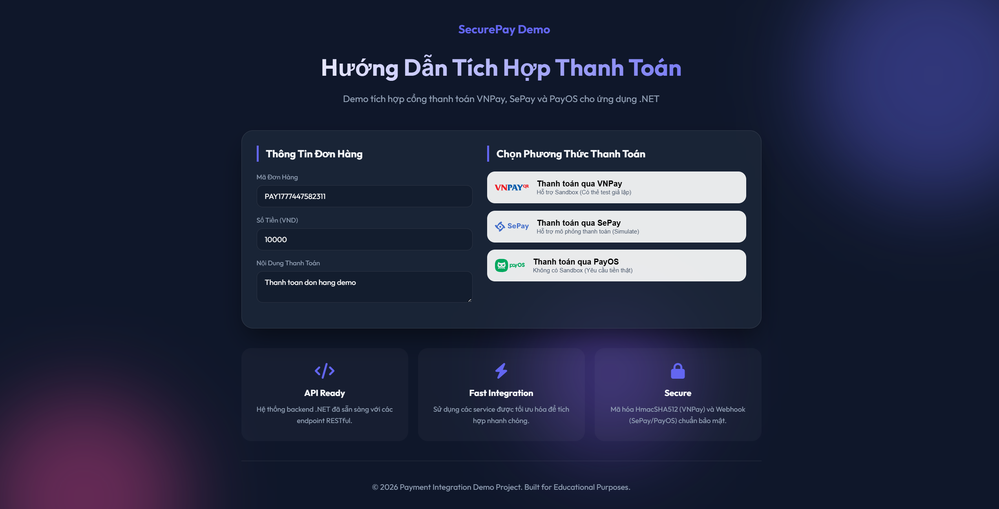

<div align="center">
  <h1>💳 .NET Payment Integration Demo</h1>
  <p><b>Giải pháp tích hợp thanh toán đa nền tảng (VNPay, SePay, PayOS) cho .NET 10</b></p>
  
  <div style="display: flex; gap: 15px; justify-content: center; margin-bottom: 20px; align-items: center;">
    <span style="display: flex; align-items: center; gap: 5px;"> </span>
    <span style="display: flex; align-items: center; gap: 5px;"> </span>
    <span style="display: flex; align-items: center; gap: 5px;"> </span>
  </div>
</div>


---

## 📑 Bảng Nội Dung

- [🌟 Tổng Quan Dự Án](#-tổng-quan-dự-án)
- [🏗 Kiến Trúc & Bảo Mật](#-kiến-trúc--bảo-mật)
- [🚀 Hướng Dẫn Cài Đặt Từng Cổng Thanh Toán](#-hướng-dẫn-cài-đặt-từng-cổng-thanh-toán)
  - [1. VNPay](#1-vnpay-qua-sdk-vnpaynet)
  - [2. SePay](#2-sepay-webhook--qr-automation)
  - [3. PayOS](#3-payos-official-sdk)
- [🏃 Chạy & Kiểm Thử](#-chạy--kiểm-thử)

---

## 🌟 Tổng Quan Dự Án

Dự án này cung cấp một bộ khung để tích hợp nhanh chóng bộ ba giải pháp thanh toán phổ biến nhất Việt Nam (**VNPay**, **SePay**, **PayOS**) vào các ứng dụng **.NET 10**.

- **Frontend:** Vanilla JS, CSS Animations, Mobile Responsive.
- **Backend:** .NET 10 Web API.
- **Tài liệu API:** Tích hợp sẵn `Scalar.AspNetCore` cho giao diện API Reference hiện đại.

---

## 🎯 Đối Tượng Sử Dụng

Dự án này được thiết kế tối ưu cho các nhu cầu sau:

1.  **Sinh viên & Học viên:** Cần demo tính năng thanh toán cho **đồ án môn học**, **đồ án tốt nghiệp** hoặc các dự án thực tế trong quá trình học tập.
2.  **Developer (Beginner/Junior):** Muốn tìm hiểu luồng tích hợp cổng thanh toán thực tế (Request -> Redirect -> Webhook/Callback -> Verify Signature).
3.  **Startup/Product Owner:** Cần một bản **PoC (Proof of Concept)** hoặc demo tính năng thanh toán cho khách hàng/nhà đầu tư trước khi triển khai chính thức.
4.  **Freelancer:** Sử dụng làm bộ source mẫu để triển khai nhanh tính năng thanh toán cho các sản phẩm vừa và nhỏ.

---

## 📸 Giao Diện Demo



---

## 🏗 Kiến Trúc & Bảo Mật

1. **Giao diện thống nhất (`IPaymentService`)**
   - Mọi phương thức tạo URL thanh toán đều được trừu tượng hóa qua interface chung, giúp dễ dàng mở rộng thêm MOMO, ZaloPay, v.v.
2. **Chuẩn hóa API (`ApiResponse<T>`)**
   - Đảm bảo cấu trúc phản hồi JSON đồng nhất giữa Frontend và Backend, hỗ trợ chứa mã lỗi và Trace ID.
3. **Bảo mật Webhook & Chữ ký**
   - Tự động xác thực HMACSHA512 (VNPay) và HMACSHA256 (SePay, PayOS) để chặn mọi Request giả mạo.
4. **Git Policy (Chống lộ Secret)**
   - Các file `appsettings.json` chứa Token được đưa vào `.gitignore`. Cung cấp sẵn file `appsettings.example.json` làm template an toàn.

---

## 🚀 Hướng Dẫn Cài Đặt Từng Cổng Thanh Toán

### 1. VNPay (Qua SDK VNPAY.NET)

Cổng thanh toán quốc gia hỗ trợ QR-Code, thẻ ATM nội địa và Visa/Mastercard quốc tế.

<details open>
<summary><b>Chi tiết cấu hình VNPay</b></summary>

- **Bước 1:** Đăng ký để nhận thông tin cấu hình từ [VNPAY Sandbox](https://sandbox.vnpayment.vn/devreg/).
- **Bước 2:** Cập nhật file `appsettings.json`:
  ```json
  "Vnpay": {
    "TmnCode": "MÃ_TMN_CỦA_BẠN",
    "HashSecret": "CHUỖI_SECRET_CỦA_BẠN",
    "BaseUrl": "https://sandbox.vnpayment.vn/paymentv2/vpcpay.html",
    "CallbackUrl": "http://localhost:5200/api/payment/vnpay-callback",
    "Version": "2.1.0"
  }
  ```
- **Tài liệu tham khảo:** [SDK GitHub](https://github.com/phanxuanquang/VNPAY.NET) | [Docs chính thức](https://sandbox.vnpayment.vn/apis/docs/thanh-toan-pay/pay.html)

> [!TIP]
> **💳 Thông Tin Thẻ Test (Sandbox)**
> (Mật khẩu OTP mặc định nếu hệ thống yêu cầu là: `123456`)
>
> | Ngân hàng | Số thẻ                | Tên chủ thẻ  | Ngày phát hành | Ghi chú                   |
> | :-------- | :-------------------- | :----------- | :------------- | :------------------------ |
> | NCB       | `9704198526191432198` | NGUYEN VAN A | 07/15          | **Thanh toán thành công** |
> | NCB       | `9704195798459170488` | NGUYEN VAN A | 07/15          | Thẻ không đủ số dư        |
> | NCB       | `9704192181368742`    | NGUYEN VAN A | 07/15          | Thẻ chưa kích hoạt        |
> | NCB       | `9704193370791314`    | NGUYEN VAN A | 07/15          | Thẻ bị khóa               |
> | NCB       | `9704194841945513`    | NGUYEN VAN A | 07/15          | Thẻ bị hết hạn            |

</details>

---

### 2. SePay (Webhook & QR Automation)

Giải pháp tự động hóa xác nhận chuyển khoản ngân hàng trực tiếp bằng cách bắt biến động số dư.

<details>
<summary><b>Chi tiết cấu hình SePay</b></summary>

- **Bước 1:** Đăng ký tài khoản tại [SePay.vn](https://sepay.vn/) và thêm tài khoản ngân hàng.
- **Bước 2:** Vào mục **Tích hợp Webhook** -> Cấu hình Endpoint trỏ về: `http://DOMAIN_CỦA_BẠN/api/payment/sepay-webhook`.
- **Bước 3:** Cập nhật file `appsettings.json`:
  ```json
  "Sepay": {
    "MerchantId": "ID_MÁY_CHỦ_SEPAY",
    "SecretKey": "API_KEY_HOẶC_SECRET_TOKEN",
    "BaseUrl": "https://pay.sepay.vn/checkout",
    "SuccessUrl": "http://localhost:5200/success.html?gateway=sepay"
  }
  ```
- **Tài liệu tham khảo:** [SePay Developer Guide](https://developer.sepay.vn/vi/cong-thanh-toan/bat-dau)

</details>

---

### 3. PayOS (Official SDK)

Cung cấp trải nghiệm thanh toán quét mã QR cực mượt và hệ thống đối soát hoàn toàn tự động.

<details>
<summary><b>Chi tiết cấu hình PayOS</b></summary>

> [!WARNING]
> PayOS hiện tại **KHÔNG cung cấp Sandbox**. Mọi giao dịch test đều yêu cầu chuyển tiền thật (Tối thiểu 2000đ).

- **Bước 1:** Đăng ký và tạo App tại [PayOS Dashboard](https://dashboard.payos.vn/).
- **Bước 2:** Cập nhật file `appsettings.json`:
  ```json
  "Payos": {
    "ClientId": "ID_CỦA_BẠN",
    "ApiKey": "KEY_CỦA_BẠN",
    "ChecksumKey": "CHECKSUM_CỦA_BẠN",
    "ReturnUrl": "http://localhost:5200/success.html?gateway=payos",
    "CancelUrl": "http://localhost:5200/error.html?gateway=payos"
  }
  ```
- **Tài liệu tham khảo:** [PayOS .NET SDK Docs](https://payos.vn/docs/sdks/back-end/net)

</details>

---

## 🏃 Chạy & Kiểm Thử

Để chạy dự án trên môi trường Local, đảm bảo bạn đã cài đặt [.NET 10 SDK](https://dotnet.microsoft.com/download).

1. **Clone repository và khôi phục thư viện:**

   ```bash
   git clone <repo-url>
   cd PaymentIntegration
   dotnet restore
   ```

2. **Copy file cấu hình:**
   _Lưu ý: Bạn phải tạo file `appsettings.json` từ file example trước khi chạy._

   ```bash
   cp appsettings.example.json appsettings.json
   ```

3. **Khởi chạy Server:**

   ```bash
   dotnet run
   ```

4. **Truy cập các Endpoint:**
   - 🌐 **Web UI Demo:** [http://localhost:5200](http://localhost:5200)
   - 📖 **API Documentation (Scalar):** [http://localhost:5200/scalar/v1](http://localhost:5200/scalar/v1)

---

<div align="center">
  <sub>Hy vọng dự án này sẽ giúp ích cho hành trình tích hợp thanh toán của bạn! ✨</sub>
</div>
